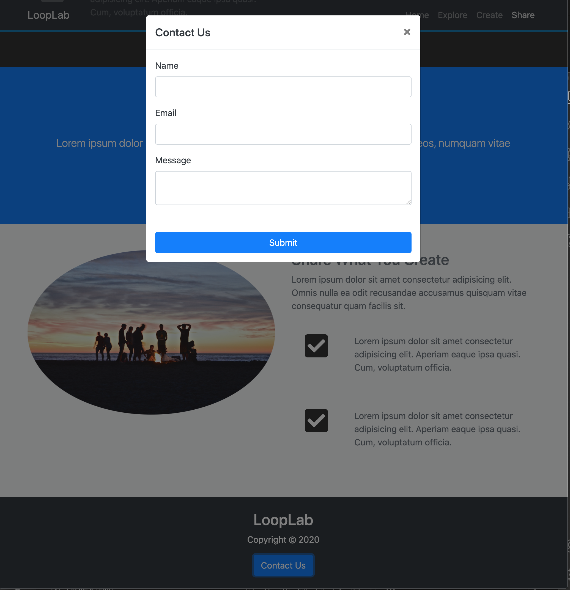

# LoopLabs - User interface built with Bootstrap

This user interface is built with Bootstrap. It is fully responsive and uses scrollspy and smooth scrolling to control the links in the navbar. A modal is used for the contact us form.

# Screenshots

Home section

Create section

Footer with contact modal

## Author

- Albert Stjärne (https://github.com/AlbertStjarne)
